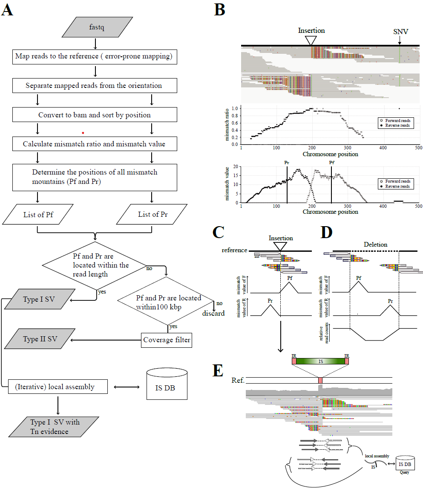

######################################################################################## 
SV-Quest 2.0

A Perl scripts to call indel position from mapped.bam.   

SV Quest: Sensitive Structure Variation detection tool

Kazuma Uesaka, Yuichi Fujita, and Kunio Ihara  


Input: 
  bam file and reference.fasta for the mapping   
Outnput:	
  indel and deletion position printed to STDOUT  

Usage:  
  perl SV-Quest.pl -f reference.fa -1 forward.fq -2 reverse.fq -b transposon.fasta -n sample1 -y 4

########################################################################################


<p align="center"></p>


    
## Requirements  
- SAMTools  (version >= 1.3.1)  
- BWA (version >= 0.7.17)  
- sambamba  (version >= 0.8.0)
- SPAdes  (version >= 3.14)
- Minimap2  


Install Anaconda (Mac OS X, Linux).  

```
mamba create -n SV-Quest2 python=3.10 -y
conda activate SV-Quest2
mamba install -c bioconda bwa samtools sambamba spades blast minimap2
sudo apt install mira-assembler
```
    


## Source
```
cd $HOME/bin/ 
git clone https://github.com/kazumaxneo/SV-Quest2.git
cd SV-Quest2/
chmod +x  SV-Quest_v2.2.6.pl
echo export PATH=\$PATH:`pwd`\ >> ~/.bash_profile && source ~/.bash_profile
SV-Quest.pl
```
    
## Run  
1, prepare Tn sequernces.  
To find endogenous IS transitions, endogenous IS multi-fasta file is necessary. We recommend using isescan program to identify endogenous IS sequernces.
```
mamba install -c bioconda isescan -y
isescan.py --seqfile NC_012624.fna --output results --nthread 8
```

## Licence ##

GPL v3.


